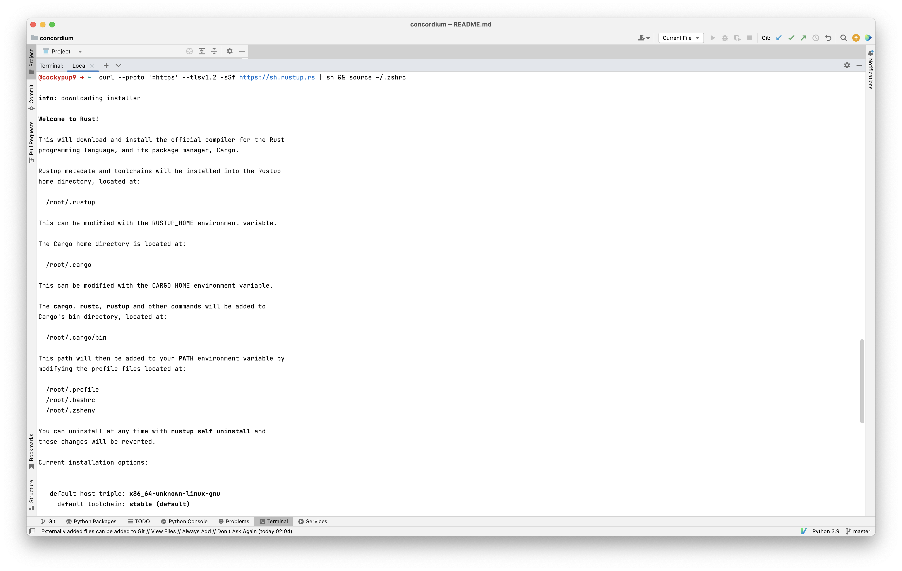
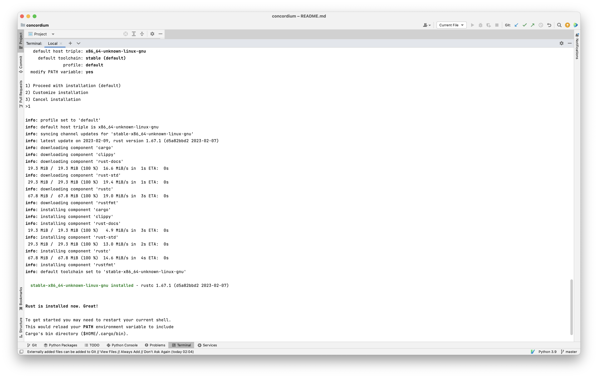
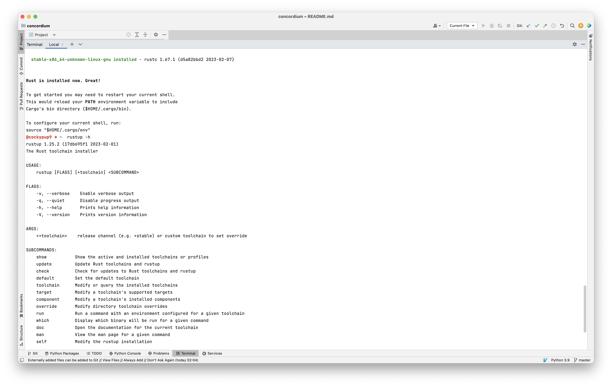
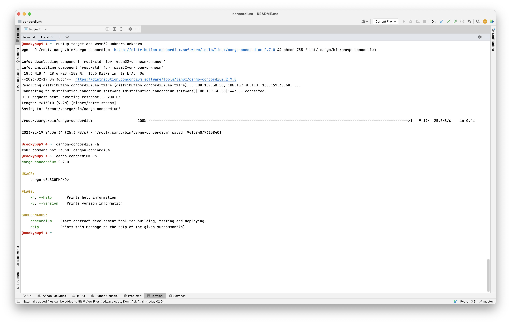
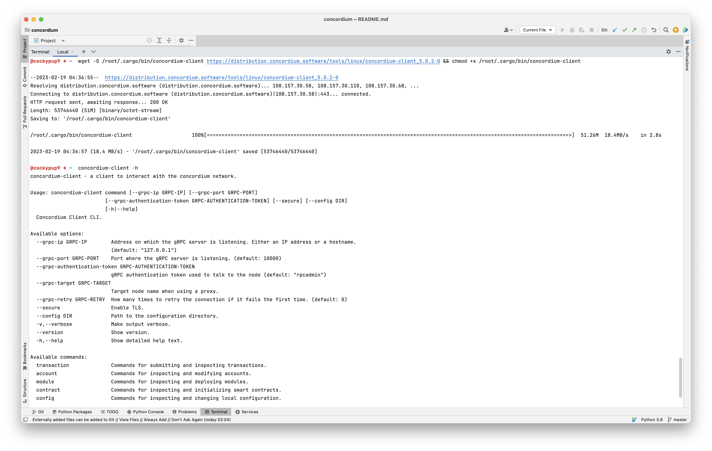
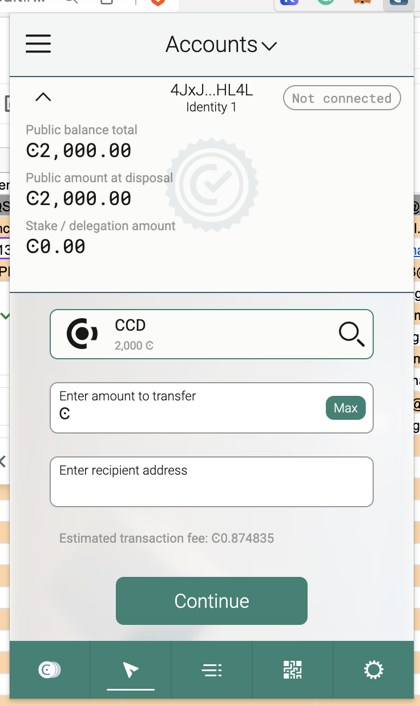
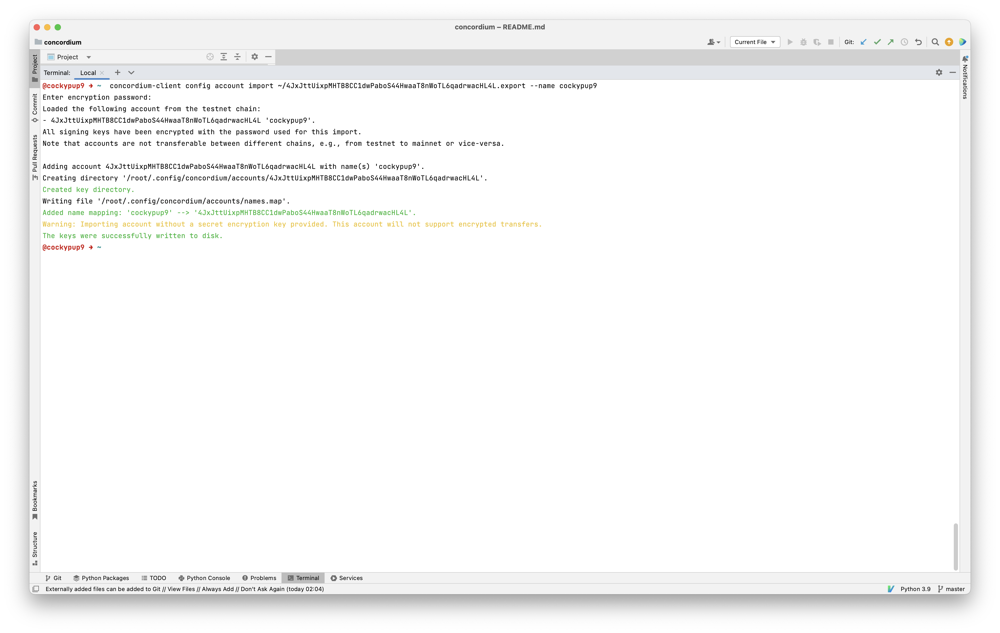

# Hackathon Submission: Task 1 for Concordium
## Mainnet

## Step 1:
Rust must be installed on your system.

## Step 2: 
Install the cargo-concordium package.

## Step 3: 
Concordium-client needs to be installed.

## Step 4: 
Obtain testnet CCD by creating a Testnet account and using the CCD faucet.

## Step 5: 
Export the account from the web wallet and import it into Concordium client.

## Mainnet Address
3QiGBP4Gfyio9S7iRgbHiRyEFC2N3dAPeZxfD6TvvSKpsNnBVR
